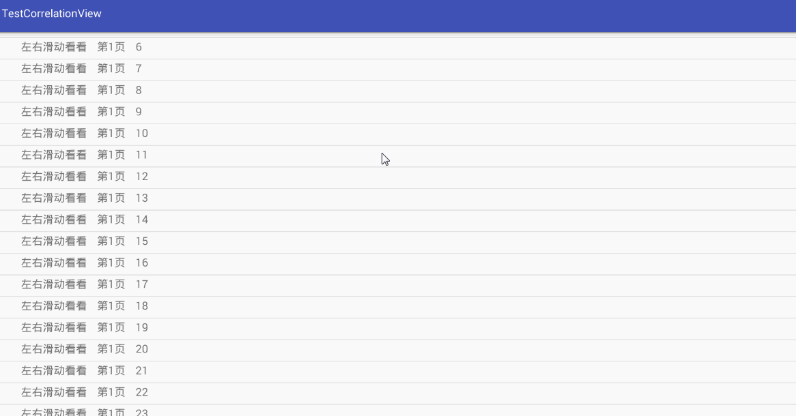

# CorrelationView

  

控件只需包含两个子View，第一个子View称为headView，第二个View称为bodyView，

可支持bodyView为ListView，RecycleView，ScrollView

当bodyView为Viewpager，Viewpager的页面包含ListView，RecycleView，ScrollView也支持

只不过要多调用一个方法
    /**
     * 只能设置滑动的View(ps:ListView,RecycleView,ScrollView)，用于判断是否可以滑动来改变HeadView的高度
     *
     * @param view
     */
    public void setBodyView(View view) {
        if (view == null) {
            throw new IllegalArgumentException("View 不能为空");
        }
        mBodyView = view;
    }
    
    有bug欢迎提出   QQ957789074
